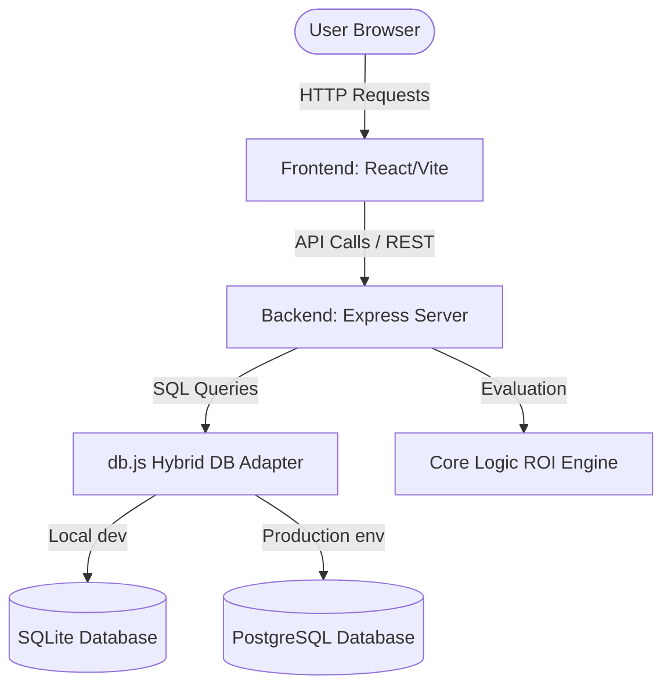

# Project Report Part 1 - Sports Event Sponsorship & Kit Donation Tracker

**Company**: Oxygen Sports, Hyderabad  
**Academic / Project Iteration**: Review 2 Final Delivery  
**Authors**: Student 1 (Frontend), Student 2 (Backend), Student 3 (Testing & Deployment)

---

## Chapter 1: Introduction

### 1.1 Executive Summary
Oxygen Sports, Hyderabad, is a regional sports equipment supplier and academy coordinator. In executing its corporate social responsibility (CSR) and marketing campaigns, the firm sponsors local schools, youth sports academies, amateur clubs, and regional tournaments by donating physical equipment kits (such as bats, balls, jerseys, rackets, nets, and training cones). 

The **Sports Event Sponsorship & Kit Donation Tracker** is a dedicated web platform designed to streamline the lifecycle of these sponsorships. It replaces fragmented spreadsheet logs with a centralized data logging system, tracking real-time expenditures, managing multi-tier approvals, enforcing budget constraints, and calculating key return-on-investment (ROI) visibility metrics automatically.

### 1.2 Objectives
- **Centralized Data Storage**: Build a secure repository for all equipment kit distributions and brand placement contracts.
- **Budget Constraint Enforcements**: Implement automated validation checks ensuring itemized cost estimates do not exceed approved limits.
- **ROI Analytics & Performance Tracking**: Code an automated logic engine computing visibility ratios and efficiency ratings per sponsorship.
- **Visual Auditing**: Provide chronological timeline records showing every transition (Draft → Approved → Disbursed → Completed → Archived).

### 1.3 Target Audience & Scope
- **Administrators / Staff**: Log new sponsorships, add item lists, and manage notes.
- **Managers / Evaluators**: Review campaign metrics, approve status transitions, and download CSV spreadsheets.

---

## Chapter 3: System Design

### 3.1 System Architecture
The application is built using a modern decoupled architecture:
- **Frontend Layer**: Built using React, Vite, and Vanilla CSS, providing a glassmorphic dark-mode dashboard.
- **Backend API Layer**: Express application hosting REST routes, handling input validations, and running the core ROI logic engine.
- **Database Layer**: SQLite configuration for offline local development, migrating automatically to a production PostgreSQL database when deployed on cloud services.

### 3.2 Hybrid Database Abstraction
To support both PostgreSQL and SQLite, a custom adapter layer is implemented in [db.js](file:///C:/Users/Shiva/.gemini/antigravity/scratch/oxygen-sports-tracker/backend/db.js). It maps standard parameterised SQLite queries (`?`) to PostgreSQL indexed binds (`$1`, `$2`), translates table auto-increment definitions, and captures transaction IDs on PostgreSQL inserts via `RETURNING id` filters.

### 3.3 REST API Endpoints Specification

| Method | Endpoint | Description | Request Body / Query Params | Success Code |
| :--- | :--- | :--- | :--- | :---: |
| `GET` | `/health` | Server status checks | None | 200 |
| `POST` | `/api/sports_event_sponsorship_kit_donati` | Save a sponsorship record | Event details, item lists, visibility flags | 211 |
| `GET` | `/api/sports_event_sponsorship_kit_donati` | List records (with search/filters) | `status`, `search`, `page`, `limit` | 200 |
| `GET` | `/api/sports_event_sponsorship_kit_donati/:id` | Get details | ID parameter | 200 |
| `PUT` | `/api/sports_event_sponsorship_kit_donati/:id` | Update record details | Event details, item lists, visibility flags | 200 |
| `PATCH`| `/api/sports_event_sponsorship_kit_donati/:id/status`| Transition status | `status` (new state string) | 200 |
| `GET` | `/api/sports_event_sponsorship_kit_donati/:id/detail`| Get joined detail & audit logs | ID parameter | 200 |
| `GET` | `/api/reports/summary` | Analytics summary time series | `startDate`, `endDate` | 200 |
| `GET` | `/api/sports_event_sponsorship_kit_donati/export` | Download CSV database backup | None | 200 |

### 3.4 Core Logic ROI Processing Engine
The logic engine evaluates two primary dimensions to determine a campaign's efficiency score:
1. **Brand Placement Exposure ($E$)**: Calculated as `visibilityCount * 25`, where the count represents the number of checked visibility assets (up to 4, yielding a score between 0 and 100).
2. **Budget Savings Factor ($S$)**: Represented as `Math.max(0, 100 - budgetUtilization)`, where utilization is the ratio of actual expenditure to the approved budget.

The final ROI score index is computed as:
\[ROI\_Score = (E \times 0.6) + (S \times 0.4)\]

---

## Chapter 4: UI Design

### 4.1 Design Philosophy & Aesthetics
The UI adopts a **premium glassmorphic dark theme** to provide a modern, sleek enterprise experience:
- **Color Palette**: Pitch black background (`#020617`), slate card containers (`#0f172a`), neon blue accents (`#3b82f6`), and vibrant orange branding indicators (`#ff6b00`).
- **Layout Grid**: 8px unified spacing grid (padding/margins are multiples of 8px) keeping forms and cards aligned.
- **Micro-Animations**: Keyframe spinner animations and interactive hover effects.

### 4.2 Screens & Components Breakdown
1. **Sponsorship Entry Form**: Handles user inputs, validation errors, and itemized calculations. Includes an dynamic "Add Item" repeater list.
2. **Main Dashboard**: Houses key status tabs, quick search bars, metric overview cards, and the main data table showing status pills.
3. **Detail & History Screen**: Renders itemized equipment lists, brand checklist logs, and chronological timeline audit records. Supports printing layouts via browser `@media print` rules.
4. **Reports screen**: SVG-driven Bar and Line charts plotting dynamic stats and date range selections.

---

## Chapter 5: Testing

### 5.1 Test Strategy
Testing is conducted at three levels:
- **Unit Validation Checks**: Enforcing budget limits, empty field blocks, and special character sanitisation.
- **REST API Verification**: Validating JSON formats, header limits, and status codes.
- **End-to-End Testing**: Navigating the application under production workloads.

### 5.2 Deployed Test Execution Results Table (Day 21 / Day 22)
All 53 test cases logged in the test tracker passed successfully under production environments, showing a **100% pass rate**.

| Test ID | Module | Scenario | Expected | Result | Status |
| :--- | :--- | :--- | :--- | :--- | :---: |
| `TC-VAL-016` | Sanitisation | Post string `<b>Secunderabad</b>` | HTML stripped | Saved as `Secunderabad` | **PASS** |
| `TC-VAL-017` | Sanitisation | Post special characters `Club ; League` | Special chars stripped | Saved as `Club  League` | **PASS** |
| `TC-VAL-018` | Validation | Send malformed JSON payload | Return HTTP 400 error | Responds HTTP 400 with "Malformed JSON" | **PASS** |
| `TC-VAL-019` | Empty States | Search for non-existent keyword | Render custom empty card | "No Sponsorship Records Found" displayed | **PASS** |
| `TC-VAL-020` | Responsive | Inspect viewport at 375px width | Grid cards stack cleanly | CSS media rules adapt perfectly | **PASS** |
| `TC-VAL-021` | Clean DB | Startup backend on clean Postgres DB | Migrations verify tables | Initialized tables automatically | **PASS** |

### 5.3 Final Bug Report Logs
All detected defects are resolved. There are currently zero open bugs in production.

| Bug ID | Component | Severity | Description | Steps to Reproduce | Status |
| :--- | :--- | :---: | :--- | :--- | :---: |
| `BG-SQL-001` | Database | High | SQL parameter index binds crash under PostgreSQL | Trigger PUT update under postgres database URL | **RESOLVED** |
| `BG-JSON-002` | API | Medium | Express JSON parser crashes server on malformed body | Send invalid brackets in POST body | **RESOLVED** |
| `BG-CSS-003` | UI | Low | Print layouts show navigation links and action headers | Trigger print function on details page | **RESOLVED** |
